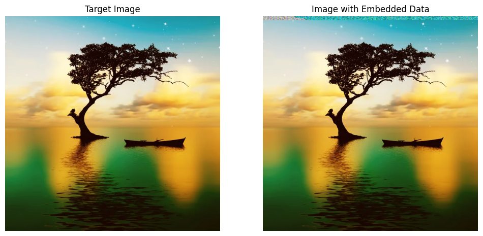

# Data Embedding in Images Using Least Significant Bits (LSB) Manipulation

Demonstrates a method for hiding a binary file within an image by embedding its bits into the least significant bits (LSBs) of the image's pixel values. The process involves reading the target image and the file to be embedded, converting the file into a bit stream, and embedding these bits into the last N bits of each byte in the image's RGB pixel values. The script ensures that the size of the data to be embedded is suitable for the target image and provides functions to recover the embedded data from the modified image, reconstructing the original binary file. This technique minimally affects the image's appearance, making it an effective steganographic method for hiding data within images.

- **compare_original_image_to_image_with_embedded.py**: This script compares the original image with the image that has embedded data and calculates the Euclidean distance between them.

- **file_embedded_with_file_with_LSB_encoding.py**: This script performs LSB (Least Significant Bit) encoding to embed a file into an image.

- **files/**: This directory contains the images and files used in the project.

  - **file_target.png**: The original target image.
  
    

  - **file_target_00.png**: Another version of the target image.
  
    

  - **file_to_be_embedded.txt**: The text file that will be embedded into the image.

  - **file_with_embedded.jpg**: The image with the embedded file.
  
    

  - **result_when_N_is1.png**: Resulting image when N is 1 during embedding.
  
    

  - **result_when_N_is1_image_large.png**: Larger version of the resulting image when N is 1.
  
    

  - **result_when_N_is5_txt_embedded_large.png**: Resulting image when N is 5 with text embedded, in a large format.
  
    

  - **result_when_N_is7.png**: Resulting image when N is 7 during embedding.
  
    

## Usage

1. **Compare Images**: Use `compare_original_image_to_image_with_embedded.py` to compare the original image with the image containing embedded data. The script calculates the Euclidean distance between the two images to determine how much they differ.

2. **Embed Data into Image**: Use `file_embedded_with_file_with_LSB_encoding.py` to embed a text file into an image using LSB encoding. This script allows you to hide data within an image file without significantly altering its appearance.

3. **Embed Image into Image**: Use `embedding_hiding_image_within_image_with_lsb_encoding.py` to embed a image file into an image using LSB encoding. 

## Example

To compare the images, run the following command:

python compare_original_image_to_image_with_embedded.py
